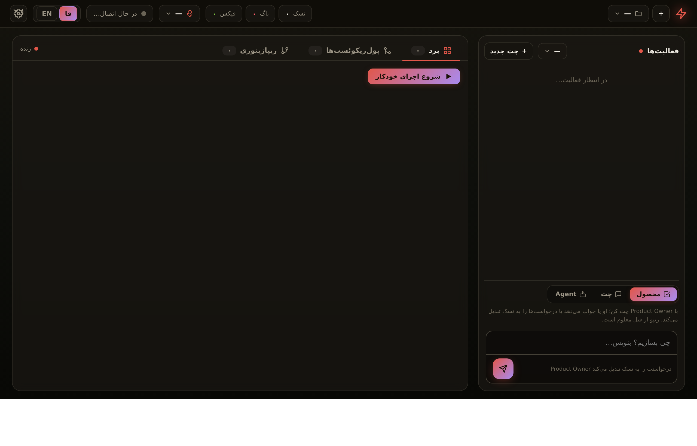

# ⚡ Mission Control — Dashboard



A dark, real-time cockpit for the autonomous startup system. It shows the live
Trello board, GitHub PRs with CI status, a SOLO-style activity/chat timeline,
and a command composer that gives you the **full Bale command set without Bale**.

All tokens stay **server-side** (read from the project's `secrets.env`); the
browser never sees them.

## Run it

The dashboard runs on the host, next to `claude-bridge.js`.

```
# 1) the Claude bridge must be running (thinking layer for idea/fix/feature/report)
node claude-bridge.js

# 2) the dashboard
node dashboard/server.js          # → http://localhost:8090
```

Optional env:

| Var            | Default                  | Meaning                          |
| -------------- | ------------------------ | -------------------------------- |
| `DASH_PORT`    | `8090`                   | port the dashboard listens on    |
| `CLAUDE_BRIDGE`| `http://localhost:8787`  | base URL of the Claude bridge    |

It reads `secrets.env` from the project root for Trello / GitHub / Bale keys —
the same file Docker injects into n8n.

## What it shows

- **Board** — the five Trello columns (To Do → Owner Review) with live cards,
  track badges (backend/frontend/mobile), complexity, and per-task 🔴 bug /
  🛠️ fix counters.
- **Pull Requests · CI** — open PRs to `develop` with their CI verdict
  (success / running / failure), linking straight to GitHub.
- **Activity** — a live timeline merged from Trello card comments (what the
  agents are doing) and your own commands, styled like a chat.
- **System health** — whether the Claude bridge is online and logged in.

## Command composer

Type a command and hit **Send** (Enter sends, Shift+Enter = newline). Quick
chips prefill the common ones. Supported, mirroring n8n WF1:

```
name: My App
repo: https://github.com/USER/REPO
idea: what to build            ← starts a new project (validate → bootstrap → tasks)

fix: the login button is broken    ← add a bug-fix task to the active project
feature: add CSV export            ← add a feature task
/report                            ← per-task status report
/exit                              ← emergency stop (wipes the board)
```

Commands act directly on Trello/GitHub (and use the Claude bridge to structure
tasks), then mirror a confirmation to Bale. Results show up on the board and in
the timeline on the next refresh (board polls every 5s, PRs every 10s).

## Notes

- The dashboard is **send-only to Bale** — it never calls `getUpdates`, because
  n8n WF1 owns that queue and double-polling would drop your messages.
- Starting a new project (`idea:`) bootstraps the repo (main+develop, monorepo
  scaffold, per-stack CI) exactly like WF1, so the GitHub token needs the
  `repo` + `workflow` scopes.
- Zero npm dependencies — plain Node `http` + `fetch`.

## Files

```
dashboard/
├── server.js            # http server: static + /api/{state,prs,activity,command}
├── lib/
│   ├── env.js           # parse secrets.env + column metadata
│   ├── trello.js        # Trello REST client
│   ├── github.js        # GitHub REST client (+ CI summary)
│   ├── claude.js        # Claude bridge client + health + tolerant JSON parse
│   ├── bale.js          # send-only Bale notifications
│   ├── owner.js         # Product-Owner control actions (idea/fix/feature/exit/report)
│   └── activity.js      # in-memory activity ring buffer
└── public/
    ├── index.html
    ├── styles.css
    └── app.js
```
